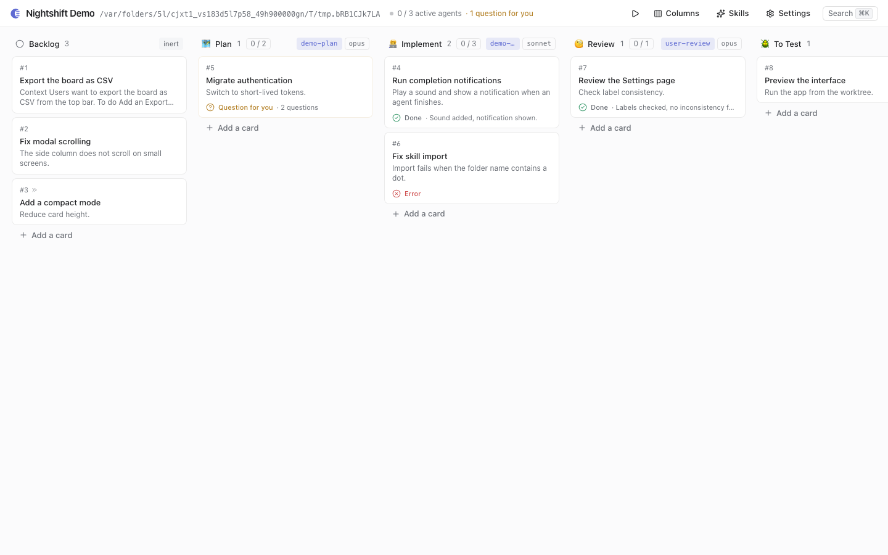

# Nightshift



[](LICENSE)
[](https://bun.sh)
[](https://docs.claude.com/en/docs/claude-code)

**Drop a card on a board, let Claude Code work through the night.** A kanban board that orchestrates Claude Code agents. One folder is one board: the whole board state lives in a single file, `nightshift.json`, at the folder root. Drop a card in a skill column and a `claude -p` agent picks it up in your project folder, reports progress, asks you questions when it is blocked, and hands the card to the next column. Leave it running and review the results in the morning.

- **Skill columns**: every card entering a column is processed by the skill you chose, in your project folder.
- **Batched questions**: a blocked agent returns all its questions at once; answering resumes the same session.
- **Feedback and resume**: send free-text feedback to the agent from any card.
- **Sequential mode**: a play/pause button moves cards one at a time.
- **One committable file**: the whole board is a single `nightshift.json`.
- **Template skills shipped**: grill, plan, implement, review and merge, copied into new projects.
- **Local only**: the server listens on `127.0.0.1` only.

[Quick start](#quick-start) · [Concepts](#concepts) · [Configuration](#configuration) · [Development](#development)

## Prerequisites

- [Bun](https://bun.sh) >= 1.4.2
- [Claude Code CLI](https://docs.claude.com/en/docs/claude-code) installed and logged in (check that `claude -p "hi"` answers)
- git
- macOS and Linux are supported; Windows is untested.

## Quick start

```sh
git clone https://github.com/MaximeGaudin/nightshift.git   # get Nightshift
cd nightshift && bun install                                 # install dependencies
claude -p "hi"                                               # check Claude Code is installed and logged in
bun start ~/code/my-project                                  # open a board for your project (opens http://localhost:4545)
```

1. On first launch Nightshift creates `nightshift.json` in your project and copies the 5 template skills into `<project>/.claude/skills/`. There is no skill install step.
2. Create a card in Backlog with a one-sentence request.
3. Drag it into Grill.

**What happens next.** The card flows Grill -> Plan -> Implement -> Review -> To Test -> Merge -> Done. When the agent needs a decision, its questions show on the card; answering in the card resumes the same session. The project must be a git repository, because the implement and merge skills use worktrees; `git init` is enough for a new folder.



## Concepts

- **Inert column**: cards just sit there.
- **Backlog column**: every board has a system Backlog column (id `col_backlog`, name `Backlog`), always first. It is inert, cannot be removed or reordered, and is recreated if missing; only its emoji can be edited. New cards from other programs land here (see below).
- **Done column**: every board has a system Done column (id `col_done`), always last. It is inert, cannot be removed or reordered, and is recreated if missing; agents moving a card into it raise no attention notification.
- **Skill column**: every card that enters it is processed by `claude -p` running the chosen skill, in the project folder. Each skill column has its own parallel agent limit (default 1, set in the columns editor); a global cap (default 3, shared by all open projects) bounds the total number of running agents.
- When done, the agent returns structured output (`--json-schema`): updated title/description, `move` (`next`, `stay` or a column id) and a summary. Nightshift applies it to the card and, if moved into another skill column, the next skill starts automatically.
- **Questions**: when an agent is blocked on human decisions, it returns all its `questions` at once and the card waits in its column. Answering in the card resumes the same Claude session (`claude --resume`) with every Q/A pair. `AskUserQuestion` is disabled for agents.
- **Feedback**: from a card's detail, in any column (inert too), you can send free-text feedback to the agent. It resumes the card's last Claude session (`claude --resume`) with your text and the current card; the agent returns `move` (`stay`, `next` = the column after the card's current column, or a column id) and may ask questions as usual. A failed or cancelled run leaves the card in place and the feedback can be sent again.
- A card is (re)run when it enters a skill column; the rerun button forces a new run. Moving or deleting a card during a run stops its agent.
- **Progression**: a running card shows live progress (step N/M and a label). Agents emit a line `[nightshift-progress] N/M label` at each step (a numbered `## Progress` section in the card sets numbering and total); until a marker is seen, the agent's TodoWrite list is used instead. Last value wins, it resets at each (re)start of the agent and is never saved in `nightshift.json`.
- Skills are read from `<project>/.claude/skills` (project, committable) and `~/.claude/skills` (user). Project skills shadow user skills. New skills are created in the project.

## Submitting tasks from other programs

A running Nightshift server accepts new cards over HTTP: `POST /api/backlog` creates a card in the Backlog column of a project.

```sh
curl -X POST http://localhost:4545/api/backlog \
  -H 'Content-Type: application/json' \
  -d '{"project": "/abs/path/to/project", "title": "Fix the login bug", "description": "Steps to reproduce...", "source": "ci-bot"}'
# 201 {"id":"card_...","number":12,"ref":"#12"}
```

Fields: `project` (required, absolute path, no `~`), `title` (required, not blank), `description` (optional), `skipColumnIds` (optional array of column ids), `source` (optional, up to 100 characters, recorded in the card history as "Created in Backlog by <source>"). Other fields, including `columnId`, are ignored: the card always goes to Backlog.

Errors are `{ "error": "..." }`: 400 for an invalid body, 404 when the project has no `nightshift.json` (a board is never created this way). A project that has a board but is not open yet is opened automatically. The server must be running (default port 4545) and only listens on `127.0.0.1`; the request needs a local `Host`/`Origin` and `Content-Type: application/json`. It also works with `--no-agents`.

## Template skills

Nightshift ships five template skills in the repository `skills/` folder: `nightshift-grill`, `nightshift-plan`, `nightshift-implement`, `nightshift-review` and `nightshift-merge`.

- When a new project gets its `nightshift.json` (the first time you open a folder), they are copied into `<project>/.claude/skills/`. A skill folder that already exists is never overwritten, and existing projects are left untouched.
- Project skills shadow the skills in `~/.claude/skills` (`NIGHTSHIFT_USER_SKILLS` overrides that user directory). Delete `<project>/.claude/skills/<name>` to fall back to your user skill of the same name.
- Customize a skill by editing its project copy, or in the Skills modal.
- If a copy fails, the board is still created and a toast names the skills that were not copied.

## Sequential mode

A play/pause button on the board moves cards one at a time. "Play" moves the first card of the first column (the backlog) into the second one, skips inert columns (except Done), then starts the next card once the current one reaches Done. "Pause" lets the running card finish but does not start the next one. The sequence stops (with a message) if the backlog is empty, if the card is deleted or moved back to the backlog, or if its run fails, is cancelled or leaves the card in place; a pending question does not stop it. Pressing play again resumes the stopped card. The state is kept in memory (never in `nightshift.json`); the routes are `POST /api/sequence/play` and `/api/sequence/pause` (`{project}`), rejected with 409 on an instance without agents.

## Language

The interface is available in English and French. Choose it in Settings -> Language: Auto (follows the browser language), English or French. The choice is stored as `language` (`auto`, `en` or `fr`) in `~/.nightshift/settings.json` and applies immediately. Server messages, agent prompts and skills stay in English.

## Configuration

```sh
bun start [project-dir] [--port 4545] [--no-open] [--no-agents]   # defaults to the current directory
```

Options: `--port <n>` / `-p <n>` (0..65535, also read from the `PORT` environment variable, default 4545), `--no-open` (do not open the browser), `--no-agents` (never start agents), `--help`. Environment: `NIGHTSHIFT_HOME` (data directory, default `~/.nightshift`), `NIGHTSHIFT_USER_SKILLS` (user skills directory, default `~/.claude/skills`), `NIGHTSHIFT_NO_OPEN` (set to any value to skip opening the browser).

The server listens on `127.0.0.1` only, and rejects requests whose `Host` or `Origin` is not local or whose body is not `application/json`.

## Files

- `<project>/nightshift.json`: columns and cards. Commit it in your projects. This repository ignores it (`.gitignore`): it is the dogfooding board of Nightshift itself. External edits (e.g. `git pull`) are picked up live.
- `~/.nightshift/settings.json`: global settings (global cap on parallel agents, permission mode, model, extra `claude` args, recent projects).
- `~/.nightshift/logs/`: last agent log per card (removed with the card).
- `~/.nightshift/screenshots/`: card screenshots.
- `~/.nightshift/locks/`: one lock per open project folder.

## Permissions

Agents run unattended with the configured `--permission-mode` (default `auto`: Claude Code's classifier approves or denies each action; anything it would escalate to a human is denied, since nobody is watching). Use the extra arguments setting for `--allowedTools`, `--max-budget-usd`, etc. `bypassPermissions` lets agents run any command in the project folder.

## Development

```sh
bun run dev    # same as start (development mode: HMR and browser console echo unless NODE_ENV=production)
bun test
```

Scripts: `bun run lint` (Biome), `bun run format`, `bun run typecheck`, `bun test`, `bun run test:coverage`, and `bun run check` (lint + typecheck + tests, run it before committing). Code is formatted and linted with [Biome](https://biomejs.dev).

## Layout

- `bin/nightshift.ts`: CLI entry point.
- `src/server/`: `store.ts` (board file), `orchestrator.ts` (queue, `claude` processes, questions), `skills.ts`, `settings.ts`, `server.ts` (HTTP + WebSocket API, serves the UI).
- `src/web/`: React UI bundled by Bun.
- `src/web/i18n/`: in-house translation layer, `en/` and `fr/` message files per namespace.
- `skills/`: template skills copied into new projects.
- `docs/assets/`: README banner and screenshot.
- `docs/logo/`: logo source.
- `test/`: tests, with `fake-claude.ts` standing in for the CLI.
- `.github/`: CI workflow, issue and pull request templates.

## Questions and bugs

Use [GitHub Issues](../../issues). To contribute, see [CONTRIBUTING.md](CONTRIBUTING.md); the project follows its [Code of Conduct](CODE_OF_CONDUCT.md) and [Security Policy](SECURITY.md). Released under the [MIT License](LICENSE).
